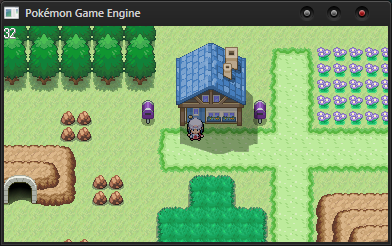
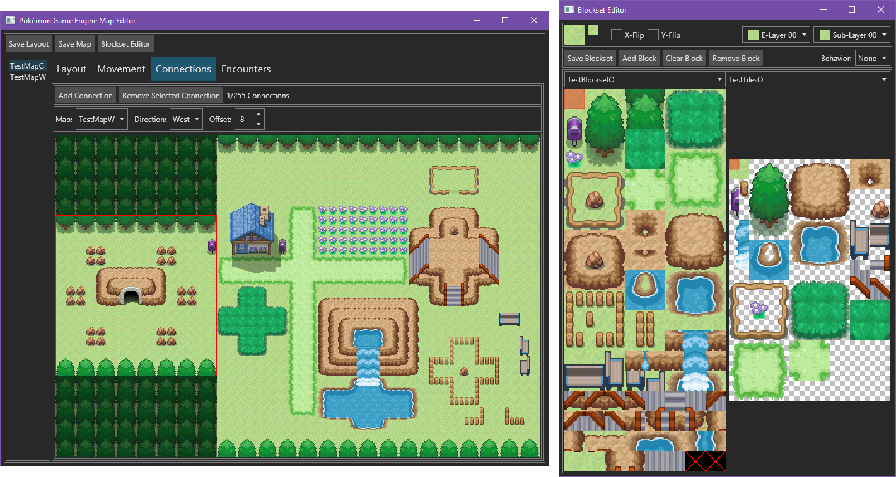

# PokemonGameEngine

Pokémon Game Engine is a C# game engine that is similar to the 2d Pokémon games.
It uses [PokemonBattleEngine](https://github.com/Kermalis/PokemonBattleEngine) for the battles.
It can run on any platform, even phones!

This project is still in a very early stage, so there is not much you can do, although you can start using it.
You will need an extension in your IDE to support NUKE build, (for Visual Studio, it's called `NUKE Support`), and will need to attach it to the build process (for Visual Studio, you use the Task Runner Explorer).
If you do not want to do that, you will need to run the `_build` project every time you want to build assets.
If you'd like to learn more or just talk, join our _(new-ish)_ [Discord server](https://discord.gg/Z4Mn9qX).

## Features:
* Map/encounter editor (Only runs on Windows, Mac, and Linux)
* Diagonal movements
* Scripting
* Wild encounters
* Very non-limiting mapping (elevations, layers, no color limits, transparency, etc)
* [Day & Night Cycle](https://gfycat.com/TightTediousEuropeanpolecat)
* Tile animations

----
## To Do:
* Proper documentation/installation guide
* Changable tiles based on day/night
* Saving
* Flags/vars
* Events on the maps
* Trainers
* Capturing Pokémon
* Default menus
* Sound/music
* Bike/surf
* Some movement behaviors (like ledges, spin tiles, waterfall, etc)

----
## PokemonGameEngine Uses:
* [Avalonia](https://github.com/AvaloniaUI/Avalonia)
* [EndianBinaryIO](https://github.com/Kermalis/EndianBinaryIO)
* [Microsoft.Data.Sqlite](https://docs.microsoft.com/en-us/ef/core)
* [Newtonsoft.Json](https://github.com/JamesNK/Newtonsoft.Json)
* [NUKE](https://github.com/nuke-build/nuke)
* [PokemonBattleEngine](https://github.com/Kermalis/PokemonBattleEngine)
* [SQLitePCLRaw](https://github.com/ericsink/SQLitePCL.raw)

## Test tiles taken from... (I did modify them a bit)
* https://www.deviantart.com/phyromatical/art/Taragonia-BW-Mix-434036293
* https://www.deviantart.com/chaoticcherrycake/art/Pokemon-Tileset-From-Public-Tiles-358379026
* https://www.deviantart.com/peekychew/art/Lava-and-Cave-Tileset-836741864