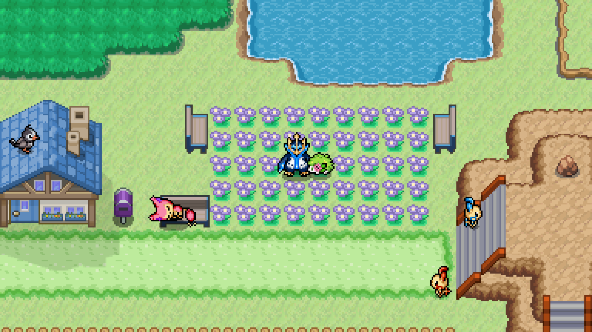
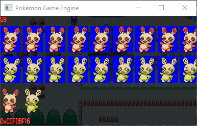
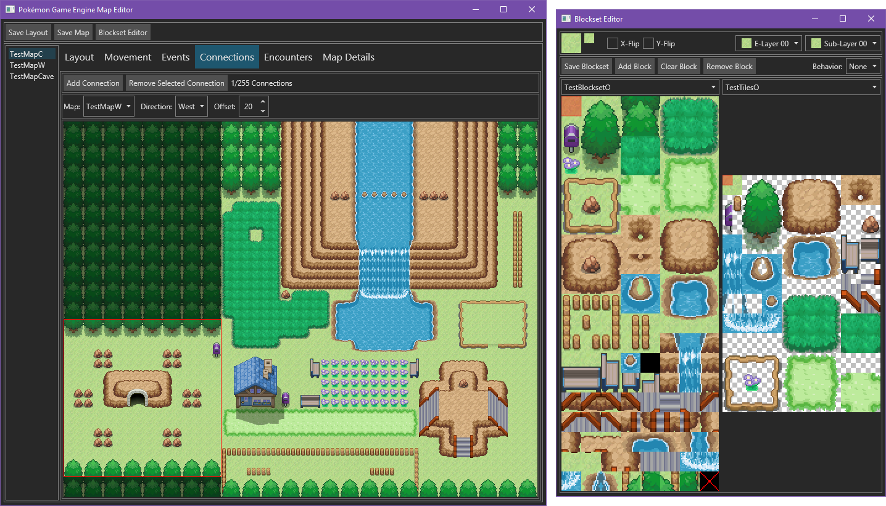

# PokemonGameEngine

[][Discord]

Pokémon Game Engine is a C# game engine that is similar to the 2D Pokémon games.
It uses [PokemonBattleEngine](https://github.com/Kermalis/PokemonBattleEngine) for the battles.
It can run on any platform, even phones! (With some work... contact me)

## Previews:
Keep in mind the quality lost when recording GIFs and videos:

https://user-images.githubusercontent.com/29823718/149649830-5e1a2c70-0f26-41f1-9f52-4d525d22dbcf.mp4

https://user-images.githubusercontent.com/29823718/149682870-9da460ba-4df6-43ed-868b-25cb6b365f7d.mp4

https://user-images.githubusercontent.com/29823718/149683554-8f34b2e6-88d9-458d-b45f-4266c5cb1315.mp4

This project is still in an early stage so don't expect to make a full game with it at this time, although you can start using it.
[Check the wiki](https://github.com/Kermalis/PokemonGameEngine/wiki) if you're interested (I put a lot of effort into writing it!).
If you'd like to learn more or just talk, join our [Discord server][Discord].

## Some Notable Features:
* Map/encounter editor (Only runs on Windows, Mac, and Linux)
* Diagonal movements
* Scripting
* Very non-limiting mapping (elevations, layers, no color limits, transparency, etc)
* Tile animations
* Day & Night cycle
* Animated sprites
* Spinda spots
* Controller & Keyboard support
* Custom sound engine and music (also supports Pokémon cries)
* Wild encounter mechanics
* Daycare, Breeding, and Eggs
* Evolution, Evolution cancelling, and Shedinja creation
* Pokérus
* Game stats
* Some debugging tools

----
## To Do:
* Update the wiki as the engine grows
* Touch input devices support
* [Check the list](TODO.txt)

----
## PokemonGameEngine Uses:
* [Assimp](https://github.com/assimp/assimp)
* [EndianBinaryIO](https://github.com/Kermalis/EndianBinaryIO)
* [Microsoft.Data.Sqlite](https://docs.microsoft.com/dotnet/standard/data/sqlite)
* [Newtonsoft.Json](https://github.com/JamesNK/Newtonsoft.Json)
* [NUKE](https://github.com/nuke-build/nuke)
* [OpenGL](https://www.opengl.org/)
* [PokemonBattleEngine](https://github.com/Kermalis/PokemonBattleEngine)
* [SDL2](https://www.libsdl.org/)
* [Silk.NET](https://github.com/dotnet/Silk.NET)
* [SimpleGIF](https://github.com/Kermalis/SimpleGIF)
* [SQLitePCLRaw](https://github.com/ericsink/SQLitePCL.raw)

## MapEditor Uses:
* [Avalonia](https://github.com/AvaloniaUI/Avalonia)
* [EndianBinaryIO](https://github.com/Kermalis/EndianBinaryIO)
* [Newtonsoft.Json](https://github.com/JamesNK/Newtonsoft.Json)
* [PokemonBattleEngine](https://github.com/Kermalis/PokemonBattleEngine)

## PokemonDumper Uses:
* [EndianBinaryIO](https://github.com/Kermalis/EndianBinaryIO)
* [Newtonsoft.Json](https://github.com/JamesNK/Newtonsoft.Json)
* [PokemonBattleEngine](https://github.com/Kermalis/PokemonBattleEngine)
* [SimpleNARC](https://github.com/Kermalis/SimpleNARC)

## Test tiles taken from... (I did modify them a bit)
* https://www.deviantart.com/chaoticcherrycake/art/Pokemon-Tileset-From-Public-Tiles-358379026
* https://www.deviantart.com/magiscarf/art/Tileset-ver-3-Free-690477146
* https://www.deviantart.com/peekychew/art/Lava-and-Cave-Tileset-836741864
* https://www.deviantart.com/phyromatical/art/Taragonia-BW-Mix-434036293

[Discord]: https://discord.gg/Z4Mn9qX
