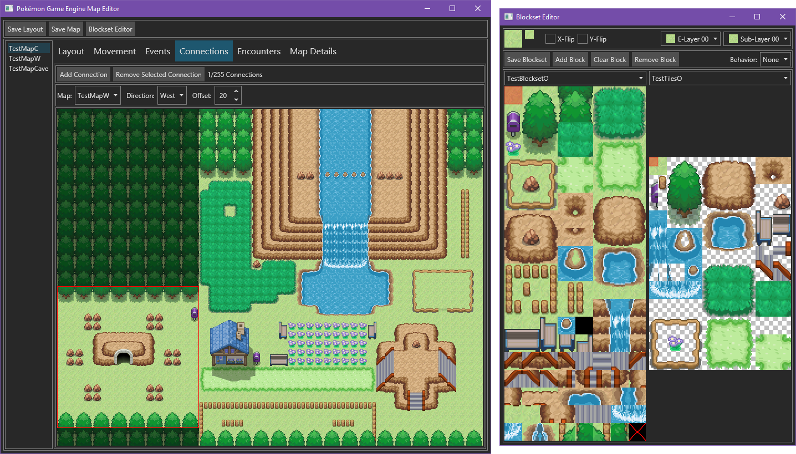

# PokemonGameEngine

[][Discord]

Pokémon Game Engine is a C# game engine that is similar to the 2D Pokémon games.
It uses [PokemonBattleEngine](https://github.com/Kermalis/PokemonBattleEngine) for the battles.
It can run on any platform, even phones! (With some work, contact me)

This project is still in a very early stage, so there is not much you can do, although you can start using it.
[Check the wiki](https://github.com/Kermalis/PokemonGameEngine/wiki) if you're interested.
If you'd like to learn more or just talk, join our _(new-ish)_ [Discord server][Discord].

## Features:
* Map/encounter editor (Only runs on Windows, Mac, and Linux)
* Diagonal movements
* Scripting
* Wild encounters
* Very non-limiting mapping (elevations, layers, no color limits, transparency, etc)
* Day & Night Cycle
* Tile animations
* Controller support
* Animated sprites
* Spinda spots 
* Sound & Music, Cries
* Daycare, Breeding, and Eggs
* Game stats
* Evolution, Evolution cancelling, and Shedinja creation

----
## To Do:
* Update the wiki as the engine grows
* Touch input devices support
* [Check the list](TODO.txt)

----
## PokemonGameEngine Uses:
* [EndianBinaryIO](https://github.com/Kermalis/EndianBinaryIO)
* [Microsoft.Data.Sqlite](https://docs.microsoft.com/en-us/ef/core)
* [Newtonsoft.Json](https://github.com/JamesNK/Newtonsoft.Json)
* [NUKE](https://github.com/nuke-build/nuke)
* [PokemonBattleEngine](https://github.com/Kermalis/PokemonBattleEngine)
* [SDL2](https://www.libsdl.org/)
* [SDL2#](https://github.com/flibitijibibo/SDL2-CS)
* [SimpleGIF](https://github.com/Kermalis/SimpleGIF)
* [SQLitePCLRaw](https://github.com/ericsink/SQLitePCL.raw)
* [SoLoud](https://github.com/jarikomppa/soloud)

## MapEditor Uses:
* [Avalonia](https://github.com/AvaloniaUI/Avalonia)
* [EndianBinaryIO](https://github.com/Kermalis/EndianBinaryIO)
* [Newtonsoft.Json](https://github.com/JamesNK/Newtonsoft.Json)
* [PokemonBattleEngine](https://github.com/Kermalis/PokemonBattleEngine)

## PokemonDumper Uses:
* [EndianBinaryIO](https://github.com/Kermalis/EndianBinaryIO)
* [Newtonsoft.Json](https://github.com/JamesNK/Newtonsoft.Json)
* [PokemonBattleEngine](https://github.com/Kermalis/PokemonBattleEngine)
* [SimpleNARC](https://github.com/Kermalis/SimpleNARC)

## Test tiles taken from... (I did modify them a bit)
* https://www.deviantart.com/phyromatical/art/Taragonia-BW-Mix-434036293
* https://www.deviantart.com/chaoticcherrycake/art/Pokemon-Tileset-From-Public-Tiles-358379026
* https://www.deviantart.com/peekychew/art/Lava-and-Cave-Tileset-836741864
* https://www.deviantart.com/magiscarf/art/Tileset-ver-3-Free-690477146

[Discord]: https://discord.gg/Z4Mn9qX